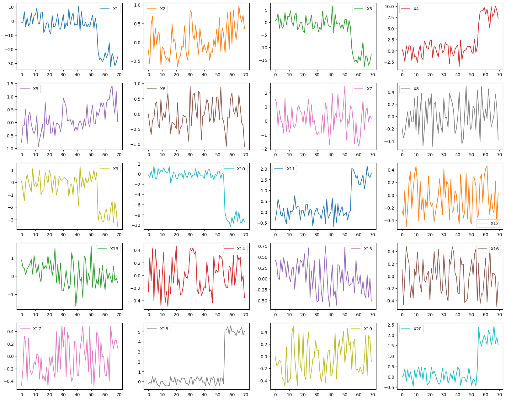
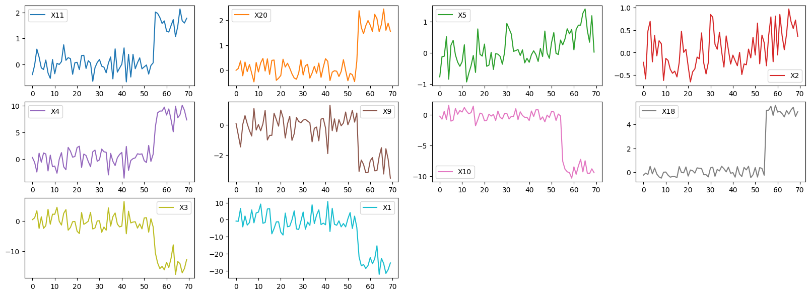

# MetricSifter: Feature Reduction of Multivariate Time Series Data for Efficient Fault Localization in Cloud Applications


This repository contains code and datasets used in the experiments described in our paper [1].

- [1]: Yuuki Tsubouchi, Hirofumi Tsuruta, ["MetricSifter: Feature Reduction of Multivariate Time Series Data for Efficient Fault Localization in Cloud Applications"](https://doi.org/10.1109/ACCESS.2024.3374334), IEEE Access (ACCESS) , Vol. 12, pp. 37398-37417, March 2024.

## Introduction

MetricSifter is a feature reduction framework designed to accurately identify anomalous metrics caused by faults for enhancing fault localization. Our key insight is that the change point times inside the failure duration are close to each other for the failure-related metrics. MetricSifter detects change points per metric, localizes the time frame with the highest change point density, and excludes metrics with no change points in that time frame. The offline change point detection is implemented by [ruptures](https://github.com/deepcharles/ruptures), and the segmentation of the detected change points is based on kernel density estimation (KDE).

## Installation

### Prerequisites

If you want to use `uv` (recommended for faster installation), install it first:

```bash
# Install uv
curl -LsSf https://astral.sh/uv/install.sh | sh

# Or using pip
pip install uv
```

### From PyPI

You can install `metricsifter` package from PyPI:

```bash
# Using pip
pip install metricsifter

# Using uv (recommended for faster installation)
uv pip install metricsifter
```

### For Development

**Note**: The core package supports Python 3.10-3.14.

```bash
# Clone the repository
git clone https://github.com/ai4sre/metricsifter.git
cd metricsifter

# Using uv (recommended)
uv sync --all-extras

# Or using pip
pip install -e ".[dev]"
```

**For running experiments** (requires Python 3.10 or 3.11):

The experiments require `sfr-pyrca`, which must be installed separately as it's not available on PyPI:

```bash
# Install sfr-pyrca from GitHub (Python 3.10 or 3.11 only)
pip install git+https://github.com/salesforce/PyRCA@d85512b
```

## Getting Started

```python
from metricsifter.sifter import Sifter
from tests.sample_gen.generator import generate_synthetic_data

## Create time series data
normal_data, abonormal_data, _, _, anomalous_nodes = generate_synthetic_data(num_node=20, num_edge=20, num_normal_samples=55, num_abnormal_samples=15, anomaly_type=0)
data = pd.concat([normal_data, abonormal_data], axis=0, ignore_index=True)

## Remove the variables of time series data
sifter = Sifter(penalty_adjust=2.0, n_jobs=1)
sifted_data = sifter.run(data=data)
print("(#removed metrics) / (#total metrics):", len(set(data.columns) - set(siftered_data.columns)), "/", len(data.columns))
print("difference between prediction and ground truth:", set(siftered_data.columns) - anomalous_nodes)
assert set(sifted_data.columns) - anomalous_nodes == set()
```

The example of original synthetic data and its sifted data is shown in the following figure.

### Before


### After



## For Developers

### Setup Development Environment

```bash
# Using uv (recommended)
uv sync --all-extras

# Or using pip
pip install -e ".[dev]"

# For experiments (Python 3.10 or 3.11 only)
pip install git+https://github.com/salesforce/PyRCA@d85512b
```

### Run Tests

```bash
pytest -s -v tests
```

### Code Quality

```bash
# Format code
black .

# Lint code
ruff check .
```

### Publishing to PyPI

This package uses GitHub Actions to automatically publish to PyPI when a new tag is pushed.

#### Publishing Process

1. **Update version in pyproject.toml**
   ```bash
   # Edit the version field
   version = "0.0.2"  # Increment as needed
   ```

2. **Commit and tag the release**
   ```bash
   git add pyproject.toml
   git commit -m "Bump version to 0.0.2"
   git tag v0.0.2
   git push origin main
   git push origin v0.0.2
   ```

3. **Automatic Publication**
   - The GitHub Actions workflow will automatically:
     - Build the package using `uv build`
     - Publish to TestPyPI (for testing)
     - Publish to PyPI (production)

#### Setup Requirements

For the workflow to work, you need to configure Trusted Publishing in PyPI:

1. Go to [PyPI](https://pypi.org/) and [TestPyPI](https://test.pypi.org/)
2. Create/login to your account
3. Go to your account settings → Publishing
4. Add a new Trusted Publisher with:
   - **PyPI project name**: `metricsifter`
   - **Owner**: `ai4sre`
   - **Repository name**: `metricsifter`
   - **Workflow name**: `publish.yaml`
   - **Environment name**: `pypi` (for PyPI) or `testpypi` (for TestPyPI)

Note: Trusted Publishing uses OpenID Connect (OIDC) and doesn't require manual API tokens.

#### Local Build Testing

To test the build locally before publishing:

```bash
# Build the package
uv build

# The built files will be in the dist/ directory:
# - metricsifter-X.Y.Z.tar.gz (source distribution)
# - metricsifter-X.Y.Z-py3-none-any.whl (wheel)
```

#### Manual Publishing (Alternative)

If you prefer to publish manually:

```bash
# Build the package
uv build

# Publish to TestPyPI (for testing)
uv publish --publish-url https://test.pypi.org/legacy/

# Publish to PyPI (production)
uv publish
```

## License

[BSD-3-Clause](LICENSE)
