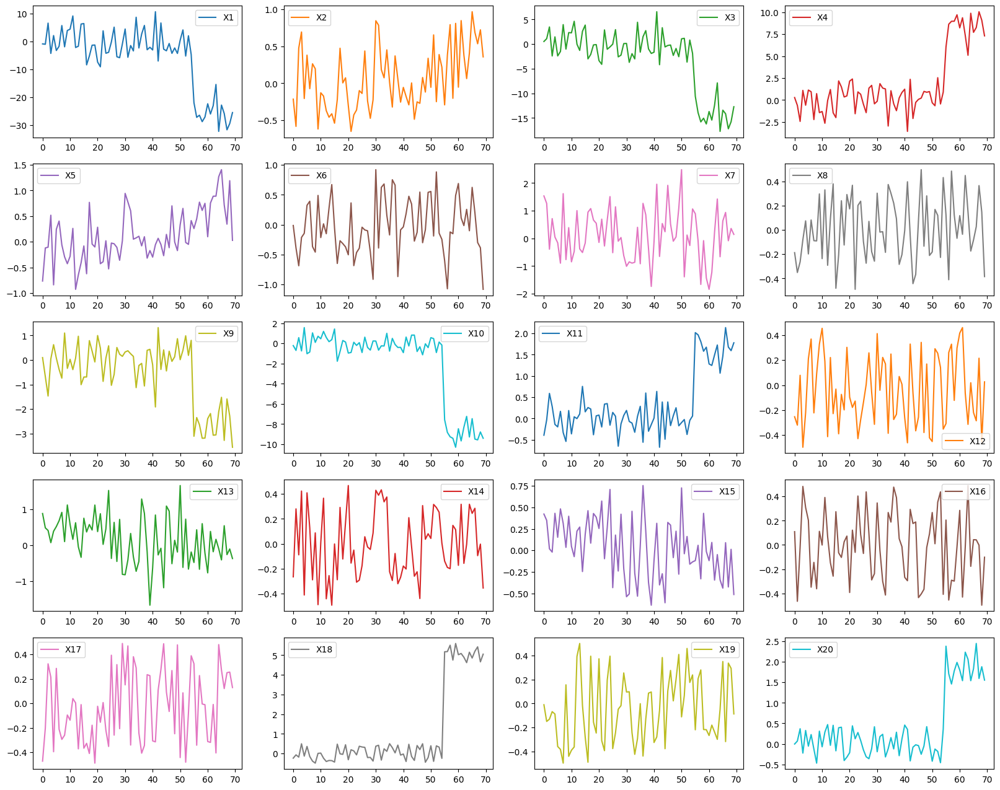
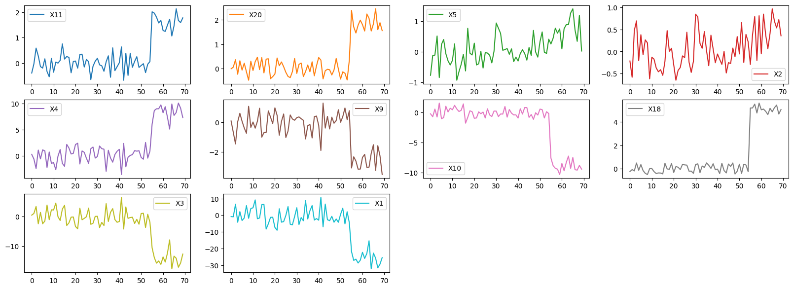

# MetricSifter: Feature Reduction of Multivariate Time Series Data for Efficient Fault Localization in Cloud Applications


This repository contains code and datasets used in the experiments described in our paper [1].

- [1]: Yuuki Tsubouchi, Hirofumi Tsuruta, ["MetricSifter: Feature Reduction of Multivariate Time Series Data for Efficient Fault Localization in Cloud Applications"](https://doi.org/10.1109/ACCESS.2024.3374334), IEEE Access (ACCESS) , Vol. 12, pp. 37398-37417, March 2024.

## Introduction

MetricSifter is a feature reduction framework designed to accurately identify anomalous metrics caused by faults for enhancing fault localization. Our key insight is that the change point times inside the failure duration are close to each other for the failure-related metrics. MetricSifter detects change points per metric, localizes the time frame with the highest change point density, and excludes metrics with no change points in that time frame. The offline change point detection is implemented by [ruptures](https://github.com/deepcharles/ruptures), and the segmentation of the detected change points is based on kernel density estimation (KDE).

## Installation

### Prerequisites

If you want to use `uv` (recommended for faster installation), install it first:

```bash
# Install uv
curl -LsSf https://astral.sh/uv/install.sh | sh

# Or using pip
pip install uv
```

### From PyPI

You can install `metricsifter` package from PyPI:

```bash
# Using pip
pip install metricsifter

# Using uv (recommended for faster installation)
uv pip install metricsifter
```

### For Development

**Note**: The core package supports Python 3.10-3.14.

```bash
# Clone the repository
git clone https://github.com/ai4sre/metricsifter.git
cd metricsifter

# Using uv (recommended)
uv sync --all-extras

# Or using pip
pip install -e ".[dev]"
```

**For running experiments** (requires Python 3.10 or 3.11):

The experiments require `sfr-pyrca`, which must be installed separately as it's not available on PyPI:

```bash
# Install sfr-pyrca from GitHub (Python 3.10 or 3.11 only)
pip install git+https://github.com/salesforce/PyRCA@d85512b
```

## Getting Started

```python
import numpy as np
import pandas as pd

from metricsifter import Sifter

## Create synthetic time series data:
## - 3 failure-related metrics with a level shift around t=60
## - 1 unrelated metric with a level shift at a different time (t=20)
## - 6 flat (no-change) metrics
rng = np.random.default_rng(0)
length = 80
data = {}
for i in range(3):
    data[f"failure_related_{i}"] = np.concatenate(
        [rng.normal(0, 0.1, 60), rng.normal(5, 0.1, 20)]
    )
data["unrelated"] = np.concatenate([rng.normal(0, 0.1, 20), rng.normal(3, 0.1, 60)])
for i in range(6):
    data[f"flat_{i}"] = np.full(length, float(i))
data = pd.DataFrame(data)

## Remove the metrics unrelated to the failure
sifter = Sifter(penalty_adjust=2.0, n_jobs=1)
sifted_data = sifter.run(data=data)
print("(#removed metrics) / (#total metrics):", len(set(data.columns) - set(sifted_data.columns)), "/", len(data.columns))
print("remained metrics:", list(sifted_data.columns))
```

The example of original synthetic data and its sifted data is shown in the following figure.

### Before


### After



## Diagnostic Report

`Sifter.run()` returns only the filtered metrics. When you need to know **why** each
metric was kept or dropped (for debugging, calibration, or handing the result to an
LLM agent), use `Sifter.sift()`, which returns a `SiftResult`:

```python
from metricsifter import Sifter

result = Sifter(penalty_adjust=2.0, n_jobs=1).sift(data=data)

# The filtered DataFrame (same as run())
result.data

# Why each metric was dropped (three mutually-exclusive reasons)
result.filtered_no_change          # removed by the no-variation filter
result.filtered_no_change_points   # no change point detected
result.filtered_out_of_segment     # change point outside the densest segment
result.selected_metrics            # metrics that were kept

# Per-metric change points (row positions) and every candidate segment with its score
result.metric_to_change_points     # {"failure_related_0": [60], ...}
result.segments                    # list of SegmentInfo (label, metrics, index range, score)
result.selected_segment            # the chosen densest segment

# JSON serialization for LLM agents / MCP tools (the DataFrame is not included)
print(result.to_json(indent=2))
```

If the input DataFrame has a `DatetimeIndex`, change points and segments are additionally
expressed as wall-clock timestamps (`result.metric_to_change_times`,
`SegmentInfo.start_time` / `end_time`). Irregular (non-uniform) sampling is supported,
since positions are converted to times purely by index lookup. `run()` and
`run_with_selected_segment()` are unchanged and fully backward compatible.

## Visualization

Plotting helpers live in `metricsifter.plot` and depend on **matplotlib**, which is an
optional extra (install with `pip install 'metricsifter[viz]'`). Importing the module
without matplotlib raises a clear error pointing at that command; the core install stays
matplotlib-free.

```python
from metricsifter import Sifter
from metricsifter import plot

result = Sifter(penalty_adjust=2.0, n_jobs=1).sift(data=data)

# Before/after time series on stacked panels, with change-point markers and the
# selected-segment band. Returns a matplotlib Figure.
fig = plot.plot_sifted_metrics(result, original_data=data)
fig.savefig("sifted.png")

# Change-point lag plot with segment boundaries and the internal KDE density curve.
# Returns a matplotlib Axes.
ax = plot.plot_change_point_density(result, time_series_length=len(data), kde_bandwidth=2.5)
```

## scikit-learn Pipeline

`SifterTransformer` exposes the sift as a scikit-learn-style transformer **without adding a
dependency on scikit-learn** (the estimator API is duck-typed). `fit` runs the sift and
remembers the selected columns; `transform` returns those columns from any DataFrame with a
matching schema (a missing column raises a clear `ValueError`).

```python
from metricsifter import SifterTransformer

tr = SifterTransformer(penalty_adjust=2.0, n_jobs=1)
reduced = tr.fit_transform(data)     # -> DataFrame of the selected metrics
tr.selected_metrics_                  # columns chosen at fit time
tr.result_                            # the full SiftResult from the fit

# When scikit-learn is installed, it drops into a Pipeline and survives clone():
from sklearn.pipeline import Pipeline
pipe = Pipeline([("sift", SifterTransformer(penalty_adjust=2.0, n_jobs=1))])
reduced = pipe.fit_transform(data)
```

## Prometheus

`metricsifter.adapters.prometheus` converts a parsed Prometheus `query_range` response
(`resultType == "matrix"`) into a wide DataFrame ready for `sift()`. It performs no HTTP:
fetch the payload yourself and pass the parsed dict. Series with mismatched timestamps are
outer-joined (missing samples become `NaN`, handled by the sift NaN support), and each column
keeps a reverse mapping back to its original Prometheus labels.

```python
from metricsifter.adapters import prometheus

# `response` is the parsed JSON of GET /api/v1/query_range
df = prometheus.from_query_range(response)     # DatetimeIndex (UTC), one column per series
labels = prometheus.to_metric_labels(df, df.columns[0])  # {"__name__": "...", "job": "...", ...}

from metricsifter import Sifter
result = Sifter(n_jobs=1).sift(df)
```

## CLI

Installing the package provides a `metricsifter` command (stdlib `argparse` only):

```bash
# Read a CSV of time series, write the sifted metrics, and dump a diagnostic report.
metricsifter run input.csv --output sifted.csv --report report.json \
    --penalty-adjust 2.0 --bandwidth 2.5 --search-method pelt --n-jobs 1

# With no --output, the sifted CSV is written to stdout.
metricsifter run input.csv --index-col 0 --parse-dates
```

Exit codes: `0` on success, `2` on input errors (missing/empty/unparseable CSV, or bad
arguments).

## Agent Integration

[agent-metricsifter](https://github.com/ai4sre/agent-metricsifter) provides Claude Code Agent Skills that combine MetricSifter with [mcp-grafana](https://github.com/grafana/mcp-grafana) for interactive incident investigation. It enables automated Prometheus metrics filtering, Grafana dashboard creation, and human-in-the-loop parameter calibration.

## For Developers

### Setup Development Environment

```bash
# Using uv (recommended)
uv sync --all-extras

# Or using pip
pip install -e ".[dev]"

# For experiments (Python 3.10 or 3.11 only)
pip install git+https://github.com/salesforce/PyRCA@d85512b
```

### Run Tests

```bash
pytest -s -v tests
```

### Code Quality

```bash
# Format code
black .

# Lint code
ruff check .
```

### Publishing to PyPI

This package uses GitHub Actions to automatically publish to PyPI when a new tag is pushed.

#### Publishing Process

1. **Update version in pyproject.toml**
   ```bash
   # Edit the version field
   version = "0.0.2"  # Increment as needed
   ```

2. **Commit and tag the release**
   ```bash
   git add pyproject.toml
   git commit -m "Bump version to 0.0.2"
   git tag v0.0.2
   git push origin main
   git push origin v0.0.2
   ```

3. **Automatic Publication**
   - The GitHub Actions workflow will automatically:
     - Build the package using `uv build`
     - Publish to TestPyPI (for testing)
     - Publish to PyPI (production)

#### Setup Requirements

For the workflow to work, you need to configure Trusted Publishing in PyPI:

1. Go to [PyPI](https://pypi.org/) and [TestPyPI](https://test.pypi.org/)
2. Create/login to your account
3. Go to your account settings → Publishing
4. Add a new Trusted Publisher with:
   - **PyPI project name**: `metricsifter`
   - **Owner**: `ai4sre`
   - **Repository name**: `metricsifter`
   - **Workflow name**: `publish.yaml`
   - **Environment name**: `pypi` (for PyPI) or `testpypi` (for TestPyPI)

Note: Trusted Publishing uses OpenID Connect (OIDC) and doesn't require manual API tokens.

#### Local Build Testing

To test the build locally before publishing:

```bash
# Build the package
uv build

# The built files will be in the dist/ directory:
# - metricsifter-X.Y.Z.tar.gz (source distribution)
# - metricsifter-X.Y.Z-py3-none-any.whl (wheel)
```

#### Manual Publishing (Alternative)

If you prefer to publish manually:

```bash
# Build the package
uv build

# Publish to TestPyPI (for testing)
uv publish --publish-url https://test.pypi.org/legacy/

# Publish to PyPI (production)
uv publish
```

## License

[BSD-3-Clause](LICENSE)
